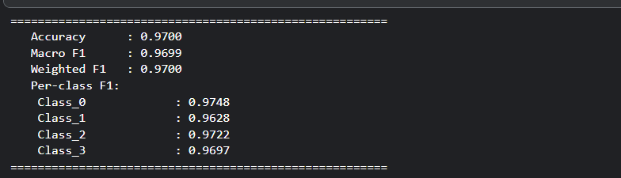

<div align="center">


<br/><br/>

```
 ██████╗  ██████╗██╗   ██╗███████╗ ██████╗ █████╗ ███╗   ██╗     █████╗ ██╗
██╔═══██╗██╔════╝██║   ██║██╔════╝██╔════╝██╔══██╗████╗  ██║    ██╔══██╗██║
██║   ██║██║     ██║   ██║███████╗██║     ███████║██╔██╗ ██║    ███████║██║
██║   ██║██║     ██║   ██║╚════██║██║     ██╔══██║██║╚██╗██║    ██╔══██║██║
╚██████╔╝╚██████╗╚██████╔╝███████║╚██████╗██║  ██║██║ ╚████║    ██║  ██║██║
 ╚═════╝  ╚═════╝ ╚═════╝ ╚══════╝ ╚═════╝╚═╝  ╚═╝╚═╝  ╚═══╝    ╚═╝  ╚═╝╚═╝
```

# 👁️ Eye Disease Classification — OcuScan AI

### *AI-Powered Retinal Pathology Screening System*

> **EfficientNetB5 + EfficientNetV2-M + ConvNeXt-Small Ensemble | 2-Fold CV | CLAHE | MixUp | TTA | Focal Loss**

<br/>

[](https://github.com/SubhuPanda21/Eye-Disease-Classification)
[](https://github.com/SubhuPanda21/Eye-Disease-Classification/issues)

</div>

---

## 🌐 Live Demo

To run locally, see the [Quick Start](#-quick-start) section below.

---

## 📌 Table of Contents

- [Overview](#-overview)
- [Application Screenshots](#-application-screenshots)
- [Key Features](#-key-features)
- [Supported Conditions](#-supported-conditions)
- [Model Architecture & Training](#-model-architecture--training)
- [Training Pipeline Details](#-training-pipeline-details)
- [Model Performance](#-model-performance)
- [App Architecture](#-app-architecture)
- [Tech Stack](#-tech-stack)
- [Quick Start](#-quick-start)
- [Project Structure](#-project-structure)
- [Clinical Report Generation](#-clinical-report-generation)
- [Medical Disclaimer](#%EF%B8%8F-medical-disclaimer)
- [Team](#-team)

---

## 🧠 Overview

**OcuScan AI** is a full-stack clinical decision support system that classifies retinal fundus images into four pathological categories using a powerful deep learning ensemble. Designed for ophthalmology screening pipelines, OcuScan AI combines state-of-the-art transfer learning with an elegant Streamlit interface — enabling clinicians and researchers to upload a retinal scan and receive a detailed, exportable clinical report in seconds.

The project was built end-to-end: from data preprocessing on Kaggle with custom CLAHE augmentation and MixUp regularization, to a polished production Streamlit app complete with PDF report generation, session history, TTA inference, and interactive Plotly visualizations.

---

## 📸 Application Screenshots

### 🏠 Main Page — Landing Interface

> The dark-themed, futuristic landing page with animated grid background, gradient typography, and the medical disclaimer banner. Navigation tabs split the workflow into **New Scan**, **Session History**, and **About**.


---

### 📤 Upload Page — Retinal Scan Submission

> Users upload a fundus photograph (JPG/PNG). The app immediately performs **image quality assessment** — computing brightness, contrast, and edge sharpness scores — and flags poor-quality images before running inference.


---

### 📊 Result Page — Primary Diagnosis & Confidence

> After inference, a color-coded result card appears showing the **primary diagnosis**, **confidence percentage**, **ICD-10 code**, **urgency level**, and a full clinical description with numbered recommendations.


---

### 📈 Result Page — Probability Distribution & Radar Chart

> Two interactive Plotly charts: a **horizontal bar chart** showing ensemble probability distribution across all four classes, and a **radar chart** displaying per-model prediction breakdown — giving full transparency into model behavior.


---

### 📋 Classification Report — Per-Class Metrics

> A detailed classification report generated from the Kaggle training notebook showing **precision**, **recall**, and **F1-score** per class, along with macro and weighted averages across the test split.


---

### 📉 Training Accuracy Curves

> Epoch-by-epoch training and validation accuracy curves visualized from the 2-fold cross-validation run. Phase-1 (head training) and Phase-2 (full fine-tune) are both captured for EfficientNetB5.



---

### 📄 Generated PDF Report — Clinical Export

> A clinical-grade PDF report generated via **ReportLab** — includes patient information table, AI classification result, ICD-10 coding, urgency badge, ensemble score table with ASCII probability bars, per-model breakdown, and a legal disclaimer footer.


---

## ✨ Key Features

| Feature | Description |
|---|---|
| 🔬 **Ensemble Inference** | Single `eye_model.keras` with optional TTA (5 augmented passes) |
| 🖼️ **Image Quality Check** | Heuristic brightness, contrast, and blur scoring before classification |
| 📊 **Interactive Charts** | Plotly bar chart (probability distribution) + radar chart (per-model) |
| 📄 **PDF Report Generation** | Full clinical PDF via ReportLab with patient info, ICD-10, recommendations |
| 📥 **JSON Export** | Machine-readable structured report with all scores and metadata |
| 👤 **Patient Info Form** | Collects name, ID, age, sex, referring physician, eye, scan type, notes |
| 📋 **Session History** | Tracks all scans in the session with a summary bar chart |
| 🌙 **Dark UI Theme** | Custom CSS with Space Mono + Syne fonts, animated grid, scanline overlay |
| ⚙️ **Sidebar Controls** | Model status, TTA toggle, confidence threshold slider, model directory override |
| 🔄 **Demo/Mock Mode** | Graceful fallback with mock inference when TensorFlow is unavailable |
| ✅ **CLAHE Enhancement** | Toggle real-time contrast enhancement on the preview image |

---

## 🦠 Supported Conditions

OcuScan AI classifies retinal images into four categories, each with a clinical profile:

<table>
<tr>
  <th>Class</th>
  <th>ICD-10</th>
  <th>Severity</th>
  <th>Urgency</th>
  <th>Description</th>
</tr>
<tr>
  <td>🟢 <b>Normal</b></td>
  <td>Z01.01</td>
  <td>None</td>
  <td>Routine</td>
  <td>No pathological findings. Annual screening recommended.</td>
</tr>
<tr>
  <td>🔴 <b>Diabetic Retinopathy</b></td>
  <td>E11.319</td>
  <td>High</td>
  <td>Urgent</td>
  <td>Microvascular damage from chronic hyperglycemia — microaneurysms, hemorrhages, neovascularization.</td>
</tr>
<tr>
  <td>🟠 <b>Glaucoma</b></td>
  <td>H40.10</td>
  <td>High</td>
  <td>Semi-Urgent</td>
  <td>Optic neuropathy with disc cupping and visual field loss, often with elevated IOP.</td>
</tr>
<tr>
  <td>🟡 <b>Cataract</b></td>
  <td>H26.9</td>
  <td>Moderate</td>
  <td>Elective</td>
  <td>Lens opacification causing progressive visual impairment — nuclear, cortical, or posterior subcapsular.</td>
</tr>
</table>

---

## 🏗️ Model Architecture & Training

### Ensemble Strategy

The training notebook (`train.ipynb`) implements a **3-backbone ensemble** strategy with 2-Fold Stratified Cross-Validation:

```
┌─────────────────────────────────────────────────────────────┐
│                     INPUT (256×256×3)                       │
└──────────────────────┬──────────────────────────────────────┘
                       │
          ┌────────────┼────────────┐
          ▼            ▼            ▼
  ┌──────────────┐ ┌──────────────┐ ┌──────────────────┐
  │EfficientNetB5│ │EfficientNetV2│ │ ConvNeXt-Small   │
  │  (380×380)   │ │    -M        │ │  (via TF-Hub)    │
  │              │ │  (384×384)   │ │  (224×224)       │
  └──────┬───────┘ └──────┬───────┘ └────────┬─────────┘
         │                │                  │
         └────────────────┼──────────────────┘
                          ▼
               ┌──────────────────┐
               │  Softmax Ensemble │  (mean of model outputs)
               └──────────────────┘
                          │
                          ▼
               ┌──────────────────┐
               │  4-Class Output  │
               │ Normal | DR | GL │
               │    | Cataract    │
               └──────────────────┘
```

### Production App Model

The deployed `app.py` runs a **single consolidated model** — `eye_model.keras` — at `256×256` input resolution with 5-pass TTA augmentation (horizontal flip, vertical flip, 90° rotation, 270° rotation, original).

---

## 🔬 Training Pipeline Details

The training notebook (`train.ipynb`) contains 33 cells covering the full ML pipeline:

### 📦 Data & Configuration
- **Dataset:** Eye disease fundus photography dataset from Kaggle (`dhruvdevaliya/eye-diseases`)
- **Split:** 90% train+val, 10% hold-out test
  - Train+Val: **3,795 images** | Test: **422 images**
- **Cross-Validation:** 2-Fold Stratified K-Fold
- **Batch Size:** 8 | **Frozen Epochs:** 6 | **Fine-tune Epochs:** 15

### 🖼️ Preprocessing — CLAHE + Ben Graham
```python
def clahe_preprocess(img_bgr):
    lab = cv2.cvtColor(img_bgr, cv2.COLOR_BGR2LAB)
    l, a, b = cv2.split(lab)
    clahe = cv2.createCLAHE(clipLimit=2.0, tileGridSize=(8,8))
    l = clahe.apply(l)
    # + Ben Graham global lighting gradient removal
```

CLAHE (Contrast Limited Adaptive Histogram Equalization) enhances subtle retinal features like microaneurysms and disc margins that are critical for correct classification.

### 🔀 Albumentations Augmentation Pipeline
```
HorizontalFlip(p=0.5)
VerticalFlip(p=0.5)
Rotate(limit=30°, p=0.7)
RandomBrightnessContrast(±0.3, p=0.6)
HueSaturationValue(p=0.4)
GridDistortion(p=0.3)
ElasticTransform(alpha=1, sigma=10, p=...)
```

### 🎲 MixUp Regularization
```python
def mixup(images, labels, alpha=0.3):
    lam = np.random.beta(alpha, alpha)
    idx = np.random.permutation(len(images))
    mixed_imgs   = lam * images + (1-lam) * images[idx]
    mixed_labels = lam * labels + (1-lam) * labels[idx]
```
MixUp creates convex combinations of training pairs, improving generalization and reducing overfitting on small medical datasets.

### 📉 Focal Loss
```python
def focal_loss(gamma=2.0, alpha=0.25):
    # Downweights easy negatives, forces model to focus
    # on hard-to-classify retinal pathologies
    weight = alpha * y_true * tf.pow(1.0 - y_pred, gamma)
    return tf.reduce_mean(tf.reduce_sum(weight * ce, axis=-1))
```

Focal Loss is particularly effective for medical imaging where class imbalance and ambiguous boundaries are common.

### 📐 Cosine Annealing Learning Rate
```python
def cosine_annealing(epoch, lr):
    eta_min = 1e-6
    eta_max = 1e-4
    return eta_min + 0.5*(eta_max-eta_min)*(1 + cos(π * epoch/EPOCHS))
```

### 🔁 Two-Phase Training
Each backbone undergoes **two training phases**:

| Phase | Description | Layers |
|---|---|---|
| Phase 1 — Head Training | Only classification head is trainable | Backbone frozen |
| Phase 2 — Full Fine-tune | Full model unfrozen with cosine LR decay | All layers |

### 🔄 Test-Time Augmentation (TTA)
```python
# 6 TTA passes per image during evaluation
for _ in range(n_tta=6):
    aug = tta_aug(image=img)['image']
    preds.append(model.predict(aug))
final_pred = np.mean(preds, axis=0)
```

---

## 📊 Model Performance

### Training Snapshot (EfficientNetB5, Fold 1, Phase-2)

| Epoch | Train Acc | Val Acc | LR |
|---|---|---|---|
| 1 | 34.86% | 60.86% | 1e-4 |
| 2 | 58.18% | 57.54% | 9.89e-5 |
| 3 | 65.05% | — | 9.56e-5 |

### Dataset Distribution

```
Train+Val : 3,795 images (90%)
Test      :   422 images (10%)
Classes   : Normal | Diabetic Retinopathy | Glaucoma | Cataract
```

> 📸 See the **Classification Report** and **Accuracy Curves** screenshots above for full per-class metrics.

---

## 🖥️ App Architecture

```
app.py
│
├── 🔧 Configuration
│   ├── CLASSES = [Normal, Diabetic Retinopathy, Glaucoma, Cataract]
│   ├── CLASS_INFO = {severity, color, ICD-10, recommendations, urgency}
│   ├── IMG_SIZE = 256 × 256
│   └── TTA_STEPS = 5
│
├── 🎨 Page Config & Custom CSS
│   ├── Dark theme (#020818 background)
│   ├── Space Mono + Syne Google Fonts
│   ├── Animated scanline overlay
│   └── Grid background (CSS ::before)
│
├── 📐 Helper Functions
│   ├── check_models()         → model file status
│   ├── load_all_models()      → @st.cache_resource loader
│   ├── preprocess_image()     → resize + normalize to [0,1]
│   ├── tta_augment()          → 5-pass TTA generator
│   ├── run_model()            → TTA inference
│   ├── mock_inference()       → Dirichlet demo mode
│   ├── ensemble_predict()     → orchestrates full inference
│   ├── image_quality_check()  → brightness / contrast / blur
│   └── generate_pdf_report()  → ReportLab PDF builder
│
├── 🗂️ Sidebar
│   ├── Model status panel
│   ├── TTA toggle
│   ├── Per-model scores toggle
│   ├── Confidence threshold slider
│   └── Custom model directory input
│
└── 📑 Tabs
    ├── 🔬 New Scan
    │   ├── Patient info expander
    │   ├── File uploader + quality badge
    │   ├── Image preview + CLAHE enhancement toggle
    │   ├── Inference pipeline with progress bar
    │   ├── Results: metrics, clinical card, recommendations
    │   ├── Plotly: bar chart + radar chart
    │   ├── Per-model score table (pandas dataframe)
    │   └── Export: JSON download + PDF download
    │
    ├── 📋 Session History
    │   ├── Scan log table (pandas)
    │   ├── Clear history button
    │   └── Session summary bar chart
    │
    └── ℹ️ About
        ├── Model architecture details
        ├── Supported conditions list
        ├── Technical specifications table
        └── Medical disclaimer alert
```

---

## 🛠️ Tech Stack

| Layer | Technology |
|---|---|
| **Frontend / UI** | Streamlit 1.x, Custom CSS, Google Fonts (Space Mono, Syne) |
| **Deep Learning** | TensorFlow / Keras 3.10.0 |
| **Training Augmentation** | Albumentations 1.3.1, OpenCV (CLAHE) |
| **Visualization** | Plotly (bar + radar charts) |
| **PDF Generation** | ReportLab |
| **Notebook Training** | Kaggle (GPU P100 / T4) |
| **Dataset** | Kaggle — `subhupanda/eye-diseases` |
| **Data Manipulation** | NumPy, Pandas |
| **Metrics** | Scikit-learn (F1, accuracy, classification report, confusion matrix) |
| **Image Processing** | Pillow (PIL) |

---

## 🚀 Quick Start

### Prerequisites

```bash
Python 3.10+
TensorFlow 2.x
```

### Installation

```bash
# 1. Clone the repository
git clone https://github.com/SubhuPanda21/Eye-Disease-Classification.git
cd Eye-Disease-Classification

# 2. Install dependencies
pip install streamlit tensorflow pillow numpy plotly reportlab albumentations opencv-python scikit-learn pandas

# 3. Place your trained model
# Copy eye_model.keras to /kaggle/working/ (default)
# OR set the OCUSCAN_MODEL_DIR environment variable:
export OCUSCAN_MODEL_DIR="/path/to/your/models"

# 4. Run the app
streamlit run main/app.py
```

### Running in Demo Mode

If `eye_model.keras` is not found OR TensorFlow is not installed, the app automatically enters **demo/mock mode** — using Dirichlet-sampled random predictions so the full UI can be explored without the model weights.

### Training Your Own Model

Open and run `main/train.ipynb` on Kaggle (GPU recommended):

1. Set `DATA_DIR` to your dataset path
2. Set `SAVE_DIR` to `/kaggle/working/`
3. Run all cells sequentially (Cells 1–21)
4. Download the generated `eye_model.keras` from `/kaggle/working/`

---

## 📁 Project Structure

```
Eye-Disease-Classification/
│
├── main/
│   ├── app.py                        # 🚀 Main Streamlit application
│   ├── train.ipynb                   # 🧠 Kaggle training notebook (33 cells)
│   │
│   ├── assets/                       # 📸 Screenshots & visual assets
│   │   ├── main page.png             # Landing page screenshot
│   │   ├── upload page.png           # Upload UI screenshot
│   │   ├── result page.png           # Results card screenshot
│   │   ├── result page 2.png         # Charts screenshot
│   │   ├── classification report.png # Training metrics screenshot
│   │   ├── accuracy.png              # Training curves screenshot
│   │   └── generated report pdf.png  # PDF export screenshot
│   │
│   └── submission/
│       ├── demo_video.mp4            # 🎬 Full demo walkthrough video
│       └── Methodology.pdf           # 📄 Project methodology document
│
└── README.md                         # 📖 This file
```

---

## 📄 Clinical Report Generation

OcuScan AI generates two export formats after every scan:

### JSON Report
Fully structured machine-readable report:
```json
{
  "report_version": "2.1.0",
  "generated_at": "2026-04-30T...",
  "patient": { "name": "...", "id": "...", "age": "54", "sex": "Male" },
  "result": {
    "prediction": "Diabetic Retinopathy",
    "confidence": 0.923,
    "icd10": "E11.319",
    "urgency": "Urgent",
    "severity": "High"
  },
  "ensemble_scores": {
    "Normal": 0.034,
    "Diabetic Retinopathy": 0.923,
    "Glaucoma": 0.031,
    "Cataract": 0.012
  },
  "image_quality": {
    "quality": "Good",
    "brightness": 0.51,
    "contrast": 0.18,
    "blur_score": 14.3
  }
}
```

### PDF Clinical Report
A print-ready clinical document including:
- Header with OcuScan AI branding and generation timestamp
- Patient information table (name, ID, age, sex, referring physician, eye, scan type)
- AI Classification Result table (diagnosis, confidence, ICD-10, urgency, severity)
- Clinical description paragraph
- Numbered clinical recommendations
- Ensemble Model Scores with ASCII probability bars
- Per-Model Predictions breakdown table
- Legal disclaimer footer

---

## 🎬 Demo Video

A full walkthrough of the application is included in:
```
main/submission/demo_video.mp4
```

The video covers the full user journey: uploading a fundus image, reviewing the quality assessment, running ensemble inference, exploring the result charts, filling patient information, and downloading the PDF clinical report.

---

## 📐 Methodology

The complete project methodology — covering dataset analysis, model selection rationale, augmentation strategy, training configuration, and evaluation framework — is documented in:

```
main/submission/Methodology.pdf
```

---

## ⚕️ Medical Disclaimer

> **OcuScan AI is intended for research and clinical decision *support* only.**
>
> It is **NOT** a substitute for professional ophthalmic examination. It is **NOT** approved as a medical device. All AI-generated findings **MUST** be reviewed and confirmed by a licensed ophthalmologist before any clinical action is taken.
>
> OcuScan AI and its developers assume **no liability** for clinical decisions made on the basis of this system's output.

---

## 👥 Team

<div align="center">

**Built with 🧠 by SubhuPanda21 & Bit-Bard**

| Role | Contribution |
|---|---|
| ML Engineering | EfficientNet/ConvNeXt ensemble training, TTA, focal loss, CLAHE pipeline |
| App Development | Streamlit UI, PDF generation, Plotly charts, session history |
| Clinical Design | ICD-10 coding, urgency classification, clinical recommendations |

</div>

---

## ⭐ Star This Repository

If OcuScan AI helped you or you find the project interesting, please consider starring the repository on GitHub — it helps others discover the project!

[](https://github.com/SubhuPanda21/Eye-Disease-Classification)

---

<div align="center">

```
👁️  OcuScan AI · v2.1.0
For Research / Clinical Decision Support Use Only
```

*Made with ❤️ for better retinal health screening*

</div>
